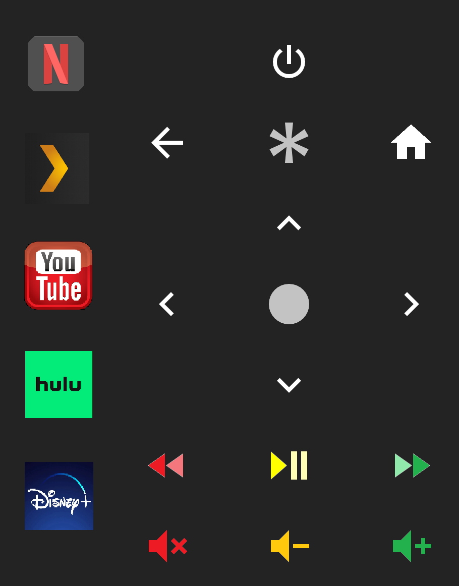

# Media Player Remote #
I began using Home Assistant because I hated having several different apps to control all of our devices. This is my attempt to combine several different devices into 1 combined & simple remote.
- Roku
- LG Smart TV
  - [Home Assistant Docs](https://www.home-assistant.io/integrations/webostv)
- Onkyo TX-NR686 Receiver
***
### Configuration.yaml ###
- Add the following line..
```
shell_command: !include YAML/ShellCommands.yaml
```
***
### ShellCommands.yaml *(Roku Specific)* ###
- Create a file in your YAML directory and paste the below cheat sheet.
- Alter the below IP to mimic your network infrastructure. Definetely recommend Static IP assignments at the Router level.
```
living_room_roku_on: "curl -X POST http://192.168.10.154:8060/keypress/PowerOn"
living_room_roku_off: "curl -X POST http://192.168.10.154:8060/keypress/PowerOff"
living_room_roku_volume_up: "curl -X POST http://192.168.10.154:8060/keypress/VolumeUp"
living_room_roku_volume_down: "curl -X POST http://192.168.10.154:8060/keypress/VolumeDown"
living_room_roku_home: "curl -X POST http://192.168.10.154:8060/keypress/Home"
living_room_roku_play: "curl -X POST http://192.168.10.154:8060/keypress/Play"
living_room_roku_reverse: "curl -X POST http://192.168.10.154:8060/keypress/Rev"
living_room_roku_forward: "curl -X POST http://192.168.10.154:8060/keypress/Fwd"
living_room_roku_select: "curl -X POST http://192.168.10.154:8060/keypress/Select"
living_room_roku_left: "curl -X POST http://192.168.10.154:8060/keypress/Left"
living_room_roku_right: "curl -X POST http://192.168.10.154:8060/keypress/Right"
living_room_roku_down: "curl -X POST http://192.168.10.154:8060/keypress/Down"
living_room_roku_volume_mute: "curl -X POST http://192.168.10.154:8060/keypress/VolumeMute"
living_room_roku_up: "curl -X POST http://192.168.10.154:8060/keypress/Up"
living_room_roku_back: "curl -X POST http://192.168.10.154:8060/keypress/Back"
living_room_roku_info: "curl -X POST http://192.168.10.154:8060/keypress/Info"
living_room_roku_plex: "curl -X POST http://192.168.10.154:8060/launch/13535"
living_room_roku_youtube: "curl -X POST http://192.168.10.154:8060/launch/837"
living_room_roku_netflix: "curl -X POST http://192.168.10.154:8060/launch/12"
living_room_roku_prime: "curl -X POST http://192.168.10.154:8060/launch/13"
living_room_roku_hulu: "curl -X POST http://192.168.10.154:8060/launch/2285"
living_room_roku_disney: "curl -X POST http://192.168.10.154:8060/launch/291097"
```
***
### Scripts ###
We are going to use the picture-elements card so we need to make a few scripts in my case.

***
### picture-elements card ###
These exact coordinates will work directly with the remote image at the bottom of this page.
```
type: picture-elements
elements:
  - type: service-button
    style:
      top: 11%
      left: 12.2%
    service: shell_command.living_room_roku_netflix
  - type: service-button
    style:
      top: 29%
      left: 12.2%
    service: shell_command.living_room_roku_plex
  - type: service-button
    style:
      top: 47%
      left: 12.81%
    service: shell_command.living_room_roku_youtube
  - type: service-button
    style:
      top: 65%
      left: 12.9%
    service: shell_command.living_room_roku_hulu
  - type: service-button
    style:
      top: 85%
      left: 13.05%
    service: shell_command.living_room_roku_disney
  - type: service-button
    style:
      top: 24.3%
      left: 36.4%
    service: shell_command.living_room_roku_back
  - type: service-button
    style:
      top: 52.1%
      left: 36.9%
    service: shell_command.living_room_roku_left
  - type: service-button
    style:
      top: 79.4%
      left: 36.9%
    service: shell_command.living_room_roku_reverse
  - type: service-button
    style:
      top: 93.1%
      left: 36.9%
    service: script.living_room_onkyo_volume_mute
  - type: service-button
    style:
      top: 10.6%
      left: 63%
    service: shell_command.living_room_roku_off
  - type: service-button
    style:
      top: 24.4%
      left: 62.5%
    service: shell_command.living_room_roku_info
  - type: service-button
    style:
      top: 38.4%
      left: 62.5%
    service: shell_command.living_room_roku_up
  - type: service-button
    style:
      top: 51.8%
      left: 63.2%
    service: shell_command.living_room_roku_select
  - type: service-button
    style:
      top: 65.8%
      left: 63.2%
    service: shell_command.living_room_roku_down
  - type: service-button
    style:
      top: 79.1%
      left: 63.2%
    service: shell_command.living_room_roku_play
  - type: service-button
    style:
      top: 93.1%
      left: 63.2%
    service: script.living_room_onkyo_volume_down
  - type: service-button
    style:
      top: 24.19%
      left: 89.5%
    service: shell_command.living_room_roku_home
  - type: service-button
    style:
      top: 52.1%
      left: 89.5%
    service: shell_command.living_room_roku_right
  - type: service-button
    style:
      top: 79.4%
      left: 89.5%
    service: shell_command.living_room_roku_forward
  - type: service-button
    style:
      top: 93.1%
      left: 89.5%
    service: shell_command.master_bedroom_roku_forward
  - type: service-button
    style:
      top: 93.1%
      left: 89.5%
    service: script.living_room_onkyo_volume_up
image: /local/Media/TV/_SDM_Remote.png
```

***
### Remote PNG ###


